# Data Flow Diagram

A data flow diagram (DFD) is a visual representation of the flow of information for any process or system. It uses defined symbols like rectangles, circles, and arrows, along with short text labels, to show data inputs, outputs, storage points, and the routes between each destination. DFDs help you better understand process or system operations to discover potential problems, improve efficiency, and develop better processes. They range from simple overviews to complex, granular displays of a process or system.

A DFD typically consists of three main components:

 Entities: These are the sources and sinks of data, such as people, systems, or devices. Entities create or use data.
 Processes: These are the activities that transform or change data. Processes can be simple or complex, and they may involve multiple steps or decisions.
 Data Store: This is where data is stored, such as databases, files, or memory.

The diagram also includes arrows to represent the flow of data between these components. The direction of the arrows indicates the direction of data flow, and the labels on the arrows describe the type of data being transferred.

Here are some key points to consider when creating a DFD:

 **Data Flow**: The movement of data between entities, processes, and data stores.  
 **Process**: An activity that transforms or changes data.  
 **Data Store**: A place where data is stored.  
 **Entities**: Sources and sinks of data, such as people, systems, or devices.  

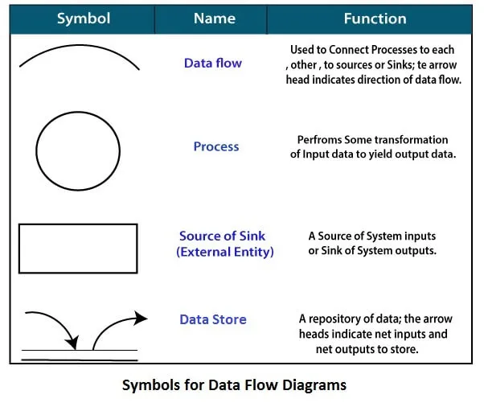

By using a DFD, you can:

- Identify the flow of data through a process or system
- Determine the sources and sinks of data
- Identify potential bottlenecks or inefficiencies
- Improve the design and implementation of a process or system
- Communicate complex information to others in a clear and concise manner

# Use Case Diagram

In the Unified Modeling Language (UML), a use case diagram can summarize the details of your system's users (also known as actors) and their interactions with the system. To build one, you'll use a set of specialized symbols and connectors. An effective use case diagram can help your team discuss and represent:

- Scenarios in which your system or application interacts with people, organizations, or external systems
- Goals that your system or application helps those entities (known as actors) achieve
- The scope of your system

A use case diagram doesn't go into a lot of detail—for example, don't expect it to model the order in which steps are performed. Instead, a proper use case diagram depicts a high-level overview of the relationship between use cases, actors, and systems. Experts recommend that use case diagrams be used to supplement a more descriptive textual use case.

UML is the modeling toolkit that you can use to build your diagrams. Use cases are represented with a labeled oval shape. Stick figures represent actors in the process, and the actor's participation in the system is modeled with a line between the actor and use case. To depict the system boundary, draw a box around the use case itself.

UML use case diagrams are ideal for:

- Representing the goals of system-user interactions
- Defining and organizing functional requirements in a system
- Specifying the context and requirements of a system
- Modeling the basic flow of events in a use case

## Use case diagram symbols and notation
The notation for a use case diagram is pretty straightforward and doesn't involve as many types of symbols as other UML diagrams. You can use this guide to learn how to draw a use case diagram if you need a refresher. Here are all the shapes you will be able to find in Lucidchart:  
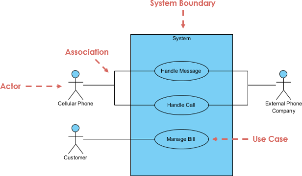  
**Use cases**: Horizontally shaped ovals that represent the different uses that a user might have.  
**Actors**: Stick figures that represent the people actually employing the use cases.  
**Associations**: A line between actors and use cases. In complex diagrams, it is important to know which actors are associated with which use cases.  
**System boundary boxes**: A box that sets a system scope to use cases. All use cases outside the box would be considered outside the scope of that system. For example, Psycho Killer is outside the scope of occupations in the chainsaw example found below.  
**Packages**: A UML shape that allows you to put different elements into groups. Just as with component diagrams, these groupings are represented as file folders.  

```
Include

When a use case is depicted as using the functionality of another use case, the relationship between the use cases is named as include or uses relationship.
A use case includes the functionality described in another use case as a part of its business process flow.
A uses relationship from base use case to child use case indicates that an instance of the base use case will include the behavior as specified in the child use case.
An include relationship is depicted with a directed arrow having a dotted line. The tip of arrowhead points to the child use case and the parent use case connected at the base of the arrow.
The stereotype "<<include>>" identifies the relationship as an include relationship.
```


```
Extends

Indicates that an "Invalid Password" use case may include (subject to specified in the extension) the behavior specified by base use case "Login Account".
Depict with a directed arrow having a dotted line. The tip of arrowhead points to the base use case and the child use case is connected at the base of the arrow.
The stereotype "<<extends>>" identifies as an extend relationship
```
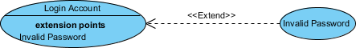

# Activity Diagram

Activity diagram is another important behavioral diagram in UML diagram to describe dynamic aspects of the system. Activity diagram is essentially an advanced version of flow chart that modeling the flow from one activity to another activity.

Activity Diagrams describe how activities are coordinated to provide a service which can be at different levels of abstraction. Typically, an event needs to be achieved by some operations, particularly where the operation is intended to achieve a number of different things that require coordination, or how the events in a single use case relate to one another, in particular, use cases where activities may overlap and require coordination. It is also suitable for modeling how a collection of use cases coordinate to represent business workflows

1. Identify candidate use cases, through the examination of business workflows
2. Identify pre- and post-conditions (the context) for use cases
3. Model workflows between/within use cases
4. Model complex workflows in operations on objects
5. Model in detail complex activities in a high level activity Diagram

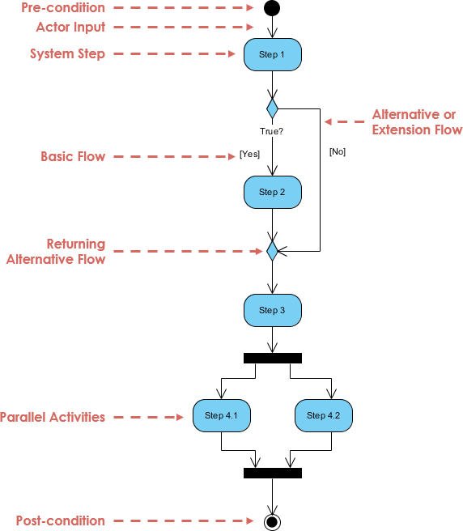

| Notation Description | UML Notation | Image |
|----------------------|--------------|-------|
| Activity | Is used to represent a set of actions | 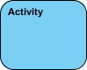 |
| Action | A task to be performed | 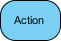 |
| Control Flow | AShows the sequence of execution | 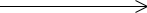 |
| Initial Node | Portrays the beginning of a set of actions or activities |  |
| Activity Final Node | Stop all control flows and object flows in an activity (or action) |  |
| Object Node | Represent an object that is connected to a set of Object Flows |  |
| Decision Node | Represent a test condition to ensure that the control flow or object flow only goes down one path | 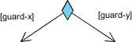 |

# Sequence Diagram

UML Sequence Diagrams are interaction diagrams that detail how operations are carried out. They capture the interaction between objects in the context of a collaboration. Sequence Diagrams are time focus and they show the order of the interaction visually by using the vertical axis of the diagram to represent time what messages are sent and when.

Sequence Diagrams captures:

- the interaction that takes place in a collaboration that either realizes a use case or an operation (instance diagrams or generic diagrams)
- high-level interactions between user of the system and the system, between the system and other systems, or between subsystems (sometimes known as system sequence diagrams)

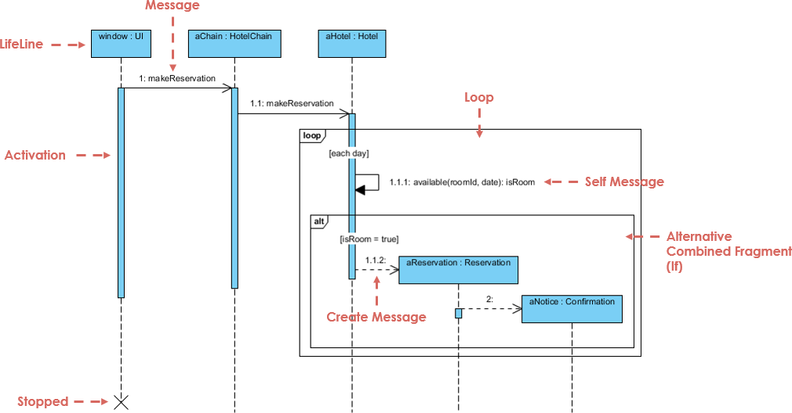

| Notation Description | Description | Image |
|----------------------|-------------|-------|
| Actor | A type of role played by an entity that interacts with the subject. Actors are external to the subject and represent roles played by human users, external hardware, or other subjects. An actor does not necessarily represent a specific physical entity but merely a particular role of some entity. | 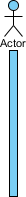|
| Lifeline  |A lifeline represents an individual participant in the Interaction. | 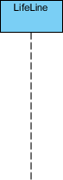|
| Activations |A thin rectangle on a lifeline that represents the period during which an element is performing an operation. The top and bottom of the rectangle are aligned with the initiation and the completion time respectively. | 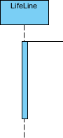|
| Call Message |  A message that defines a particular communication between Lifelines of an Interaction. Call message represents an invocation of an operation of the target lifeline. | 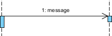|
| Return Message |  A message that defines a particular communication between Lifelines of an Interaction. Return message represents the pass of information back to the caller of a corresponded former message. | 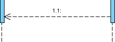|
| Self Message |  A message that defines a particular communication between Lifelines of an Interaction. Self-message represents the invocation of a message of the same lifeline. | 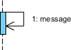|
| Recursive Message |  A message that defines a particular communication between Lifelines of an Interaction. Recursive message represents the invocation of a message of the same lifeline. Its target points to an activation on top of the activation where the message was invoked from. |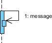 |
| Create Message |  A message that defines a particular communication between Lifelines of an Interaction. Create message represents the instantiation of the target lifeline. | 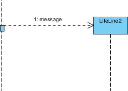|

# Communication Diagram

UML communication diagrams, like the sequence diagrams - a kind of interaction diagram, shows how objects interact. A communication diagram is an extension of object diagram that shows the objects along with the messages that travel from one to another. In addition to the associations among objects, communication diagram shows the messages the objects send each other.

Purpose of Communication Diagram
- Model message passing between objects or roles that deliver the functionalities of use cases and operations
- Model mechanisms within the architectural design of the system
- Capture interactions that show the passed messages between objects and roles within the collaboration scenario
- Model alternative scenarios within use cases or operations that involve the collaboration of different objects and interactions
- Support the identification of objects (hence classes), and their attributes (parameters of message) and operations (messages) that participate in use cases 

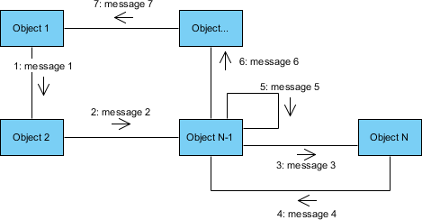

## Communication Diagram vs Sequence Diagram
```
The communication diagram and the sequence diagram are similar. They're semantically equivalent, that is, the present the same information, and you can turn a communication to a sequence diagram and vice versa. The main distinction between them is that the communication diagram arranged elements according to space, the sequence diagram is according to time.

Of the two types of interaction diagrams, sequence diagrams seem to be used far more than communication diagrams. So, why would you use communication diagrams? First of all, they are very useful for visualizing the relationship between objects collaborating to perform a particular task. This is difficult to determine from a sequence diagram. In addition, communication diagrams can also help you determine the accuracy of your static model (i.e., class diagrams).
```

| Element | Description |
|---------|-------------|
| Objects | Objects in a collaboration are categorized into suppliers and clients. Supplier objects provide methods and receive messages, while client objects call methods and send messages. |
| Links | Links are connecting lines between objects in a communication diagram. They illustrate relationships between objects and symbolize the ability of objects to send messages to each other. A loop icon represents a message sent by an object to itself. |
| Messages | Messages in communication diagrams are represented as arrows from the client object to the supplier object. They indicate a client invoking an operation on a supplier object. Message icons contain one or more messages with sequence numbers, indicating their time-ordering. |


# Comparison

| Diagram Type       | Advantages                                                                                                                                                                   | Disadvantages                                                                                                                                                                         | Use                                                                                                                                                                |
|--------------------|------------------------------------------------------------------------------------------------------------------------------------------------------------------------------|---------------------------------------------------------------------------------------------------------------------------------------------------------------------------------------|--------------------------------------------------------------------------------------------------------------------------------------------------------------------|
| Dataflow Diagram  | - Clearly visualizes the flow of data within a system. - Helps in identifying data sources, transformations, and destinations. - Useful for system analysis and design.     | - May oversimplify complex systems. - May not effectively capture non-linear or dynamic data flows.                                                                                  | - System analysis and design. - Identifying data dependencies and transformations. - Process modeling.                                                             |
| Use Case Diagram   | - Provides a high-level view of system functionality from a user's perspective. - Helps in identifying actors, use cases, and their relationships.                            | - May become complex and hard to maintain for large systems. - May not capture all system interactions or edge cases.                                                                  | - Requirement analysis and elicitation. - Stakeholder communication. - Identifying system boundaries and actors.                                                  |
| Class Diagram     | - Clearly depicts the structure of a system, including classes, attributes, methods, and relationships. - Supports modeling of inheritance, encapsulation, and polymorphism. | - Can become overly complex for large systems. - May not capture dynamic aspects of system behavior.                                                                                   | - Object-oriented design. - Modeling class structures and relationships. - Implementation guidance for developers.                                                 |
| Activity Diagram  | - Models workflow or business processes effectively. - Visualizes the sequence of activities and decision points. - Supports modeling parallel or concurrent activities.     | - Can become too detailed for simple processes. - May not capture all possible paths or exceptions in complex workflows.                                                               | - Business process modeling. - Workflow analysis and optimization. - Use case realization.                                                                         |
| Sequence Diagram  | - Illustrates interactions between objects in a sequential manner. - Visualizes the flow of messages between objects. - Helps in understanding system behavior over time.      | - May become cluttered for complex systems with many interactions. - May not capture all asynchronous or concurrent interactions.                                                      | - Designing and documenting system behavior. - Identifying object interactions and dependencies. - Understanding message flows and timing constraints.           |
| Communication Diagram | - Depicts object interactions and relationships in a more abstract way. - Emphasizes the relationships between objects. - Shows the flow of messages between objects.         | - May lack detail compared to sequence diagrams. - Can be less intuitive for understanding timing constraints and message sequences.                                                   | - Modeling high-level object interactions and relationships. - Collaborative design discussions. - Architectural overview of system communication flows. |
